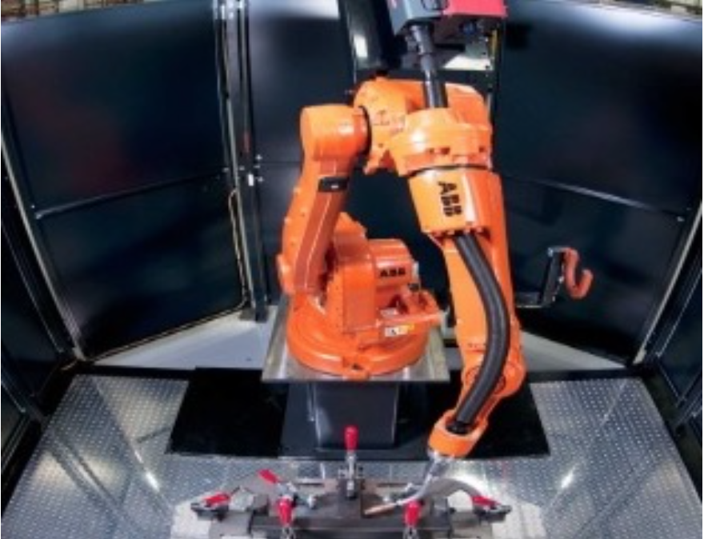
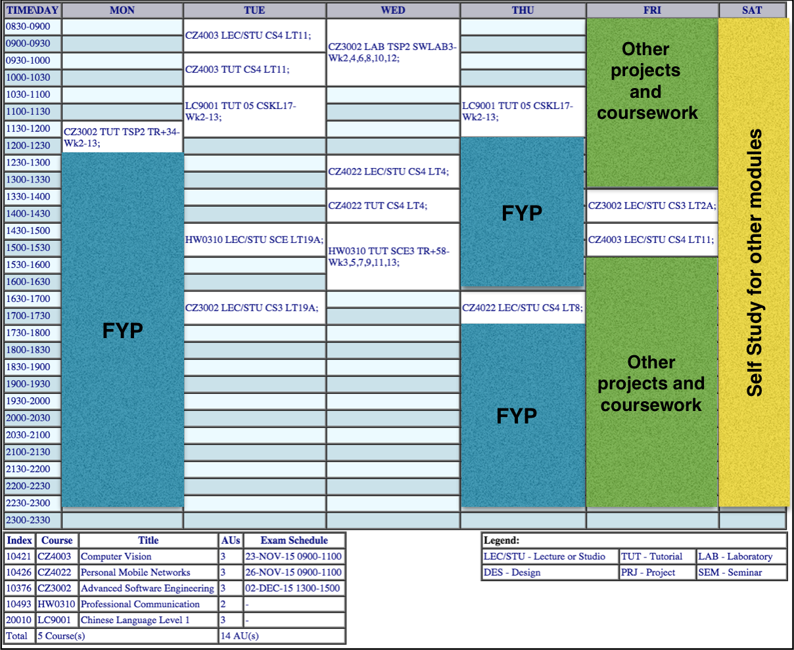

---
#Robot Monitoring of Robotic processes using Vision and Sensors

#FINAL YEAR PROJECT PLAN

**PREPARED BY**

**YE LIN AUNG**

***

##Abstract

Nowadays, most industries are widely using the automatic robotic systems
in manufacturing processes because of productivity, efficiency and so
on. However, in most of industries, monitoring of these processes are
still done by human operators. The objective of this project is to
monitor robotic processes by using intelligent sensors, perform the
quality assurance by microcontroller and control the actions of the
robot remotely. In order to remotely monitor robot arm and its working
environment, different kinds of sensors are employed. 3D depth camera is
used to capture the images and send them to microcontroller. The system
also includes other sensors like temperature probe, force and dust
sensors to monitor the working environment. Arduino board is used to
control robotic arms and sensors. By using Jetson TK1, it can process
the image and measure the depth of the objects. It then creates the
point cloud image and identify the scratches or abnormalities. Depending
on the results, it will perform its action and alert the operator. The
notification alert includes the possible roots of the failure then the
operator can fix the fault effectively.

***

##Perspective

In this project, here are few things that are expected and required to
be learned -

-   Applications of computer vision

<!-- -->

-   Object detection and image processing

<!-- -->

-   Point Cloud Library (PCL)

<!-- -->

-   Usage of Kinect sensors and Jetson Tk1

<!-- -->

-   Operations of Linux

<!-- -->

-   OpenCV

<!-- -->

-   Other Vision Libraries

<!-- -->

-   Application of different sensors

<!-- -->

-   Robotic Applications

***

##Reasons that I love about Computer Vision

According to Mobile marketing statics, total number of smartphone users
is over 2 billion people. As almost everyone is using smartphones and
pictures can be taken easily, pictures are a big part of our lives. If
we, programmers and researchers, can make computers understand the
images easily and accurately, most of the current daily tasks can be
done automatically. Furthermore, it will also creates limitless
applications and software for developers. It will then affects and
improves our lifestyles.

***

##Planning

**Semester 1 Weekly Timetable**

***

**Project Timeline**

Task Title  | No of Days | Start Date | End Date
--- | :---: | :---: | :---:
Project Introduction and Literature survey - vision | 14 | 11 Aug 2015 | 28 Aug 2015
Camera Sourcing and Procurement | 15 | 31 Aug 2015 | 18 Sep 2015
Object detection and tracking | 20 | 21 Sep 2015 | 16 Oct 2015
Integration and User Acceptance test with Jetson | 15 | 19 Oct 2015 | 6 Nov 2015
Preparation for exam and exam period |  | 6 Nov 2015 | 6 Dec 2015
Going back to hometown | | 7 Dec 2015 | 27 Dec 2015
Integration and User Acceptance test with ABB robot | 20 | 28 Dec 2015 | 22 Jan 2016
Fesability for AI framework for image analysis  | 20 | 25 Jan 2016 | 19 Feb 2016
Project Report and Demo | 15 | 22 Feb 2016 | 11 Mar 2016

***

##Resources

**Hardware resources**

-   Jetson TK1

<!-- -->

-   Arduino board

<!-- -->

-   Kinect

<!-- -->

-   Force Sensor

<!-- -->

-   Temperature Probe

<!-- -->

-   Dust Sensor

**Software resources**

-   Linux Operating System (Ubuntu)

<!-- -->

-   Computer Vision Libraries (OpenCV, etc)

<!-- -->

-   Robot Operating System

<!-- -->

-   Point Cloud Library

**Language**

-   C++

<!-- -->

-   C

As most of the hardware and software resources are still new to me, I
will have to put more effort than others to learn these functionalities.
There are multiple tutorials and references online for Linux OS and ROS.

I am currently taking Computer Vision specialisation course, therefore,
I can learn more about vision technologies and their applications. As
for vision libraries, openCV is the reliable site for practical
purposes. I am familiar with C and C++ language, therefore computer
language is not an obstacle for me.

***

##Reading List
- [About Jetson TK1](http://elinux.org/Jetson_TK1)[*Jetson\_TK1*](http://elinux.org/Jetson_TK1)

- [Robot Operating System](http://www.ros.org)

- [Point cloud library](http://pointclouds.org)

- [Force Sensor](https://www.tekscan.com/products-solutions/force-sensors/a201)

- [Dust Sensor](https://www.sparkfun.com/products/9689)

- [Basic Introduction about depth sensor and computervision](http://robotica.unileon.es/mediawiki/index.php/PCL/OpenNI_tutorial_0:_The_very_basics)[*The\_very\_basics*](http://robotica.unileon.es/mediawiki/index.php/PCL/OpenNI_tutorial_0:_The_very_basics)

- [Basics of ABB robot and programming](http://www.ece.ufrgs.br/~fetter/esp/basic.pdf)

- [Online course ( optional)  to familiarise with robotics and vision](https://www.udacity.com/course/intro-to-artificial-intelligence--cs271)

- [Image processing using OpenCV](http://www.cs.iit.edu/~agam/cs512/lect-notes/opencv-intro/)

- [OpenCV Tutorials](http://docs.opencv.org/doc/tutorials/tutorials.html)

- [Linux Tutorial for beginners](http://www.ee.surrey.ac.uk/Teaching/Unix/)

- [Linux Tutorials](http://ryanstutorials.net/linuxtutorial/)

- [Learn C++](http://www.learncpp.com/)
